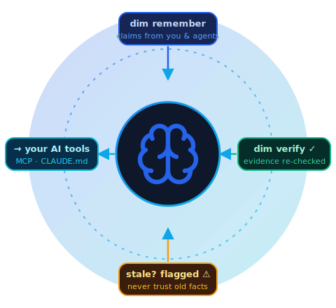

<div align="center">


# AI Dimag — Verified Memory for AI Coding Agents

**Your codebase remembers its decisions, conventions, and rules — and proves they're still true.**

[](https://www.npmjs.com/package/aidimag)
[](./LICENSE)
[](https://aidimag.com)
[](https://nodejs.org)

[**Documentation**](https://aidimag.com) • [**Getting Started**](https://aidimag.com/getting-started) • [**AI Dimag Cloud**](https://cloud.aidimag.com) • [**Pricing**](https://aidimag.com/pricing)

</div>

---

## What is AI Dimag?

**AI Dimag** gives any MCP-compatible agent (Claude, Cursor, Copilot, Windsurf…) a **persistent memory** of your codebase that survives across sessions — decisions, conventions, gotchas, failed approaches, **guardrails**, and reusable **skills** — stored as **falsifiable claims with grounding evidence** in `.aidimag/` next to your code.

### 🎯 The Difference: Verified, Not Just Stored

Every memory carries **evidence** (a shell check, an anchored commit, a test) that `dim verify` re-runs against the current repo. Beliefs that stop being true go **STALE** instead of silently misleading your AI.

### ✨ Works with Every AI Tool

- **MCP tools** (Claude, Cursor, etc.) get real-time memory via the MCP server
- **Non-MCP tools** (Copilot, Windsurf, etc.) get static context files (`.cursorrules`, `CLAUDE.md`, `AGENTS.md`, etc.)

<div align="center">

</div>

## Install

```sh
npm install -g aidimag
```

Requires Node 18+. Ships two equivalent binaries: `dim` (short) and `aidimag`.

## 🚀 Quick Start

```sh
cd your-repo
dim init                    # creates .aidimag/, installs additive git hooks
dim bootstrap               # optional: LLM-survey the repo into a starter memory set
dim review                  # approve what enters memory (nothing is stored unreviewed)

dim remember "All DB access goes through src/db/store.ts" -k INVARIANT -p src/db \
  -e "STATIC_CHECK:grep -rL better-sqlite3 src --include=*.ts"
dim recall db access
dim verify                  # re-run all evidence; stale beliefs get flagged
dim brief                   # session-start briefing: in-scope memory, guardrails, gaps

# For non-MCP tools (Copilot, Cursor without MCP, etc.):
dim generate-context --format all --auto   # creates .cursorrules, CLAUDE.md, AGENTS.md, etc.
```

## 🔌 Connect to Your AI Agent (MCP)

Add to your agent config (e.g. `.mcp.json` for Claude Code):

```json
{
  "mcpServers": {
    "aidimag": {
      "command": "npx",
      "args": ["-y", "aidimag", "mcp"],
      "env": { "AIDIMAG_REPO": "/path/to/your/repo" }
    }
  }
}
```

**MCP Tools** get `memory_search`, `memory_propose`, `context_note` (live in-chat fact capture), `memory_critique` (a second critic grounded in verified memory), session-start briefings, session-end extraction, and more.

**Non-MCP Tools**: `dim generate-context -f all` renders verified memory into `.cursorrules`, `CLAUDE.md`, `AGENTS.md`, `.windsurfrules`, and `.github/copilot-instructions.md` (`--auto` keeps them refreshed).

## ✨ Key Features

### 🛡️ Human-Gated Capture
Commits, PRs, AI-chat transcripts, and pasted docs are mined into *proposals*. Nothing enters memory until you approve it in `dim review` (auto-triaged best-first, `approve all --min-score 0.7` for batches).

### ✅ Verification Lifecycle
`STATIC_CHECK` / `COMMIT_REF` / `TEST_RESULT` / `EXEC_TRACE` / `HUMAN_ATTESTED` evidence. Failing evidence flips memories to STALE and auto-drafts a recovery proposal. Confidence decays without re-confirmation.

### 🔒 Evidence Trust Gate
Shell-command evidence that arrives via team sync is **never executed** until you inspect and approve it (`dim verify --trust`).

### 🔍 Hybrid Semantic Recall
FTS5 keyword + vector KNN (OpenAI or local Ollama, auto-detected; works keyword-only with neither).

### 🚦 Guardrails & Skills
Behavioral rules (`never` / `ask-first` / `always`) and step-by-step procedures, enforced by `dim check` (pre-commit) and `memory_critique`.

### 👥 Team Mode, Self-Hosted
`dim serve` + `dim sync`: local-first replicas, device-code login, brain-scoped API keys, hashed credentials, cross-machine verification consensus.

### 📚 Knowledgebase Inbox
Drop design docs / ADRs / PDFs / DOCX into `knowledge/` and they're summarized into reviewed, pinned memories.

### 🎨 Web Dashboard & Extensions
`dim ui` plus VS Code and IntelliJ extensions.

## 📖 Documentation

<table>
<tr>
<td width="33%">

**Getting Started**
- [Installation](https://aidimag.com/getting-started)
- [Quick Start (5 min)](https://aidimag.com/quickstart)
- [Cloud Sync](https://aidimag.com/cloud-quickstart)

</td>
<td width="33%">

**Reference**
- [CLI Reference](https://aidimag.com/cli-reference)
- [MCP Integration](https://aidimag.com/mcp)
- [Configuration](https://aidimag.com/configuration)

</td>
<td width="33%">

**Guides**
- [Team Sync](https://aidimag.com/guides/team-sync)
- [Guardrails](https://aidimag.com/guides/guardrails)
- [Context Files](https://aidimag.com/guides/generate-context)

</td>
</tr>
</table>

Full documentation: **[aidimag.com](https://aidimag.com)**

---

## 💰 Pricing

**Free for teams of 10 or fewer users** under the [Elastic License 2.0](./LICENSE).

For larger teams or commercial use beyond this limit, a commercial license is required. See [**Pricing & Licensing**](https://aidimag.com/pricing) for details.

---

<div align="center">

**Built by [Anup Khanal](https://github.com/anup-khanal)**

[Website](https://aidimag.com) • [Documentation](https://aidimag.com) • [Cloud](https://cloud.aidimag.com) • [npm](https://www.npmjs.com/package/aidimag) • [License](./LICENSE)

</div>

